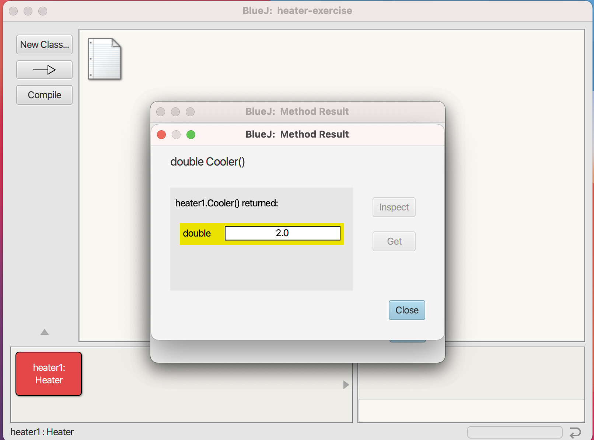

## Heater

## Introduction
Heater project models a heater that allows us to get warmer or to get cooler 
with incrementing temperature option .Its a BlUEJ Project.

### Prerequisites
* BLUEJ 4.2.2.

## ScreenShots

## Create Heater Object

## Create New Heater

## Create Object

## Functions Of Heater

## Get Cooler

## Get Warmer

## Get Temperature

## Set Increment

## Get Cooler After Incrementing By 5

## Get Warmer After Increment by 3

